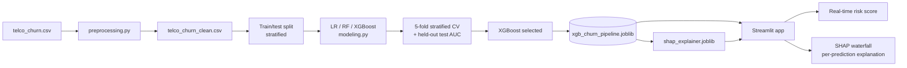

# Customer Churn Predictor

Binary classifier predicting customer churn on the Telco Churn dataset, with SHAP explainability and a Streamlit app for real-time risk scoring.

🔗 **Live app:** _add Streamlit Cloud link here_


## Problem

Telecom companies lose ~26% of customers to churn. Predicting *who* is likely to leave — and *why* — lets retention teams intervene before it happens. This project trains a classifier on the [Telco Customer Churn dataset](https://www.kaggle.com/datasets/blastchar/telco-customer-churn) and pairs it with SHAP to explain individual predictions, not just spit out a score.

## Models compared

| Model | CV AUC (mean ± std) | Test AUC |
|---|---|---|
| Logistic Regression | 0.8460 ± 0.0053 | 0.8361 |
| Random Forest | 0.8316 ± 0.0061 | 0.8194 |
| XGBoost | 0.8423 ± 0.0040 | 0.8275 |

XGBoost was selected as the final model despite Logistic Regression's slightly higher AUC, for `scale_pos_weight`-based class handling and to demonstrate SHAP explainability on a non-linear model. `scale_pos_weight` was computed dynamically from the train split's actual class ratio (2.76) rather than hardcoded.

## Key insight from EDA

Churn rate is 42.7% for month-to-month contracts vs. 11.3% for one-year and 2.8% for two-year contracts — by far the strongest single driver in the dataset.

## Project structure

```
churn-predictor/
├── data/               # raw + cleaned data, saved model (gitignored)
├── notebooks/          # 01_eda.ipynb, 02_modeling.ipynb, 03_shap.ipynb
├── src/                # config.py, preprocessing.py, modeling.py
├── app/                # streamlit_app.py
├── requirements.txt
└── README.md
```

## Running locally

```bash
git clone <repo-url>
cd churn-predictor
python -m venv .venv
source .venv/bin/activate  # Windows: .venv\Scripts\activate
pip install -r requirements.txt
streamlit run app/streamlit_app.py
```

## What the app does

- Customer profile input form (sliders + dropdowns)
- Real-time churn risk score, color-coded green/orange/red
- SHAP waterfall chart explaining the specific prediction
- Tab 2: global feature importance (SHAP beeswarm)

## Tech stack

Python, pandas, scikit-learn, XGBoost, SHAP, Streamlit

## Architecture



## What I'd improve with more time

- **Revisit the model choice given the actual numbers.** Logistic Regression has the highest CV and test AUC here — I picked XGBoost mainly to showcase SHAP, which is a fair tradeoff for a portfolio project but worth being upfront about in an interview rather than implying XGBoost simply "won."
- **Add a business-cost-weighted metric.** AUC treats false positives and false negatives symmetrically, but a missed churner (false negative) is more costly to a retention team than a wasted outreach (false positive). I'd add a cost-weighted threshold or precision/recall-at-k tuned to a realistic retention-campaign budget.
- **Deploy the live app.** The README still has "https://churn-predictor-n24yt6zun2hfxrqemyausj.streamlit.app/" — actually hosting it removes friction for a recruiter clicking through.
- **Track drift over time.** This is trained once on a static Kaggle snapshot; a production version would need monitoring for feature drift as contract mixes, pricing, and customer behavior change.
