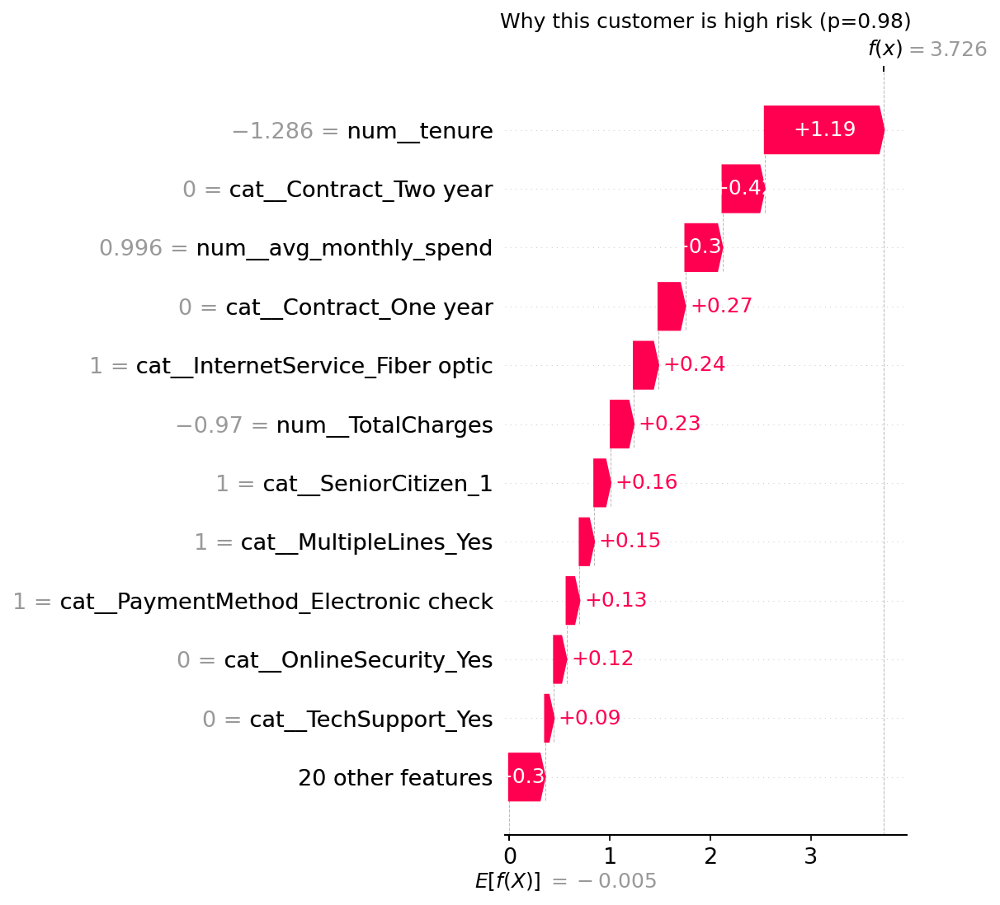

# Customer Churn Predictor

Binary classifier predicting customer churn on the Telco Churn dataset, with SHAP explainability and a Streamlit app for real-time risk scoring.

🔗 **Live app:** _add Streamlit Cloud link here_



## Problem

Telecom companies lose ~26% of customers to churn. Predicting *who* is likely to leave — and *why* — lets retention teams intervene before it happens. This project trains a classifier on the [Telco Customer Churn dataset](https://www.kaggle.com/datasets/blastchar/telco-customer-churn) and pairs it with SHAP to explain individual predictions, not just spit out a score.

## Models compared

| Model | CV AUC (mean ± std) | Test AUC |
|---|---|---|
| Logistic Regression | _fill in_ | _fill in_ |
| Random Forest | _fill in_ | _fill in_ |
| XGBoost | _fill in_ | _fill in_ |

XGBoost was selected as the final model (`scale_pos_weight` set dynamically from the train split's class ratio).

## Key insight from EDA

Churn rate is highest for month-to-month contracts vs. one/two-year contracts — _fill in actual numbers from notebook_.

## Project structure

```
churn-predictor/
├── data/               # raw + cleaned data, saved model (gitignored)
├── notebooks/          # 01_eda.ipynb, 02_modeling.ipynb, 03_shap.ipynb
├── src/                # config.py, preprocessing.py, modeling.py
├── app/                # streamlit_app.py
├── requirements.txt
└── README.md
```

## Running locally

```bash
git clone <repo-url>
cd churn-predictor
python -m venv .venv
source .venv/bin/activate  # Windows: .venv\Scripts\activate
pip install -r requirements.txt
streamlit run app/streamlit_app.py
```

## What the app does

- Customer profile input form (sliders + dropdowns)
- Real-time churn risk score, color-coded green/orange/red
- SHAP waterfall chart explaining the specific prediction
- Tab 2: global feature importance (SHAP beeswarm)

## Tech stack

Python, pandas, scikit-learn, XGBoost, SHAP, Streamlit
